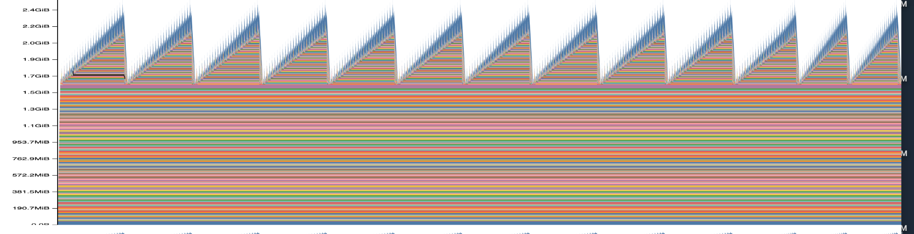
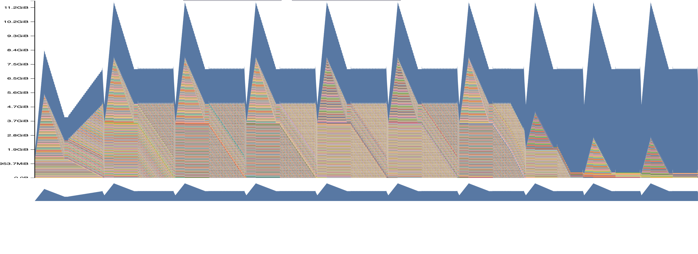
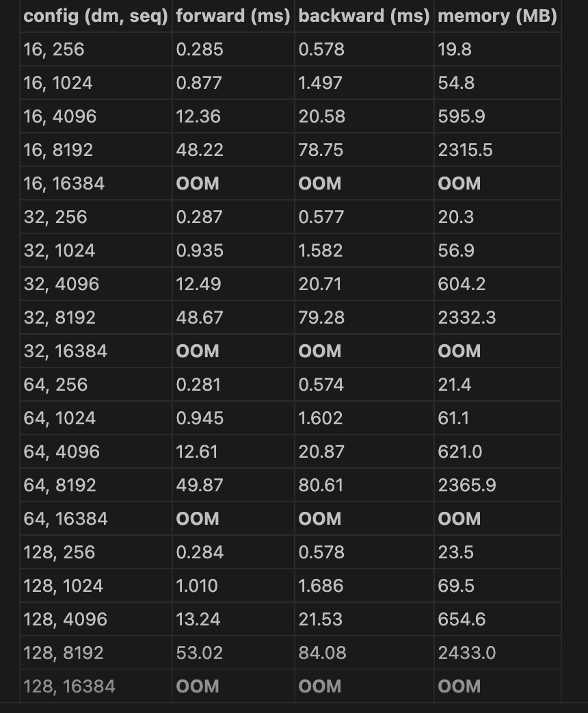
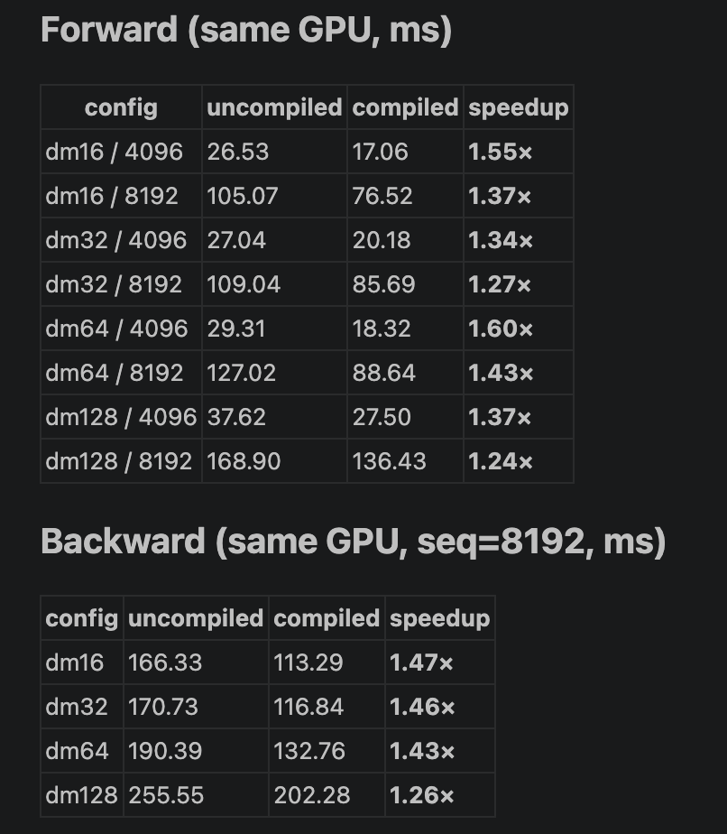

 

## benchmarking (benchmarking_script) Benchmarking Script (4 points)

avg times (Nvidia A10g) 24GB vram

|           size | forward -> bf16                | backward -> bf16                  | optimizer                |
| ---------------------------------------------------------------- | ------------------------------ | ---------------------------------- | ------------------------ |
| medium                                                           | `0.26643766 -> 0.10127733`   | `0.4587786941`-> `0.1861862`  | `0.14121633`           |
| small                                                            | `0.08554444 -> 0.0383745`    | `0.15805660 -> 0.0677986`        | `0.044848017100093784` |
| large                                                            | `0.5746536`-> `0.2095301` | `0.7332923672`-> `0.41691168` |                          |
|                                                                  |                                |                                    |                          |
|                                                                  |                                |                                    |                          |

b) summary: there isn't high variance in measurements. e.g. for small sized backward:

`[0.155400114999793, 0.16185579300008612, 0.15900551100003213, 0.15671139400001266, 0.1558691190002719, 0.16091336899989983, 0.1554171339998902, 0.1566138600001068, 0.15741760499986412, 0.16136210400009077]`

c) without warmups for small-sized model:

`avg_time: 0.11434968599996864 [0.3869096419998641, 0.08636572400018849, 0.08393283299983523, 0.0840278959999523, 0.08393553399992015, 0.08332610500019655, 0.0835795979996874, 0.08410777299968686, 0.08368879700037724, 0.0836229579999781] `

observation: first run is 3 seconds which is about 30x average run. so, warm up seems essential

## Problem (mixed_precision_accumulation): Mixed-Precision Accumulation (1 point)

`tensor(10.0001) `

`tensor(9.9531, dtype=torch.float16) `

`tensor(10.0021) `

`tensor(10.0021)`

it isn't big deal but even float32 isn't perfectly accurate on this. it is giving `10.0001`. float64 gave 10.0

## Problem (benchmarking_mixed_precision): Benchmarking Mixed Precision (2 points)

- model parameters are still in fp32
- the model’s predicted logits are in fp16
- after ln: fp32
- loss: `torch.float32`
- model’s gradients: float32
- the output of the first feed-forward layer (ToyModel.fc1): fp16

b) What parts of layer normalization are sensitive to mixed precision?: division. you divide by root of variance square. and variance calculation: summing over squared differences .lose precision

- if we use bf16 than fp16, we still have precision problem. but we do get larger range, so we dont get overflow, underflow much.

## Problem (memory_profiling): Memory Profiling (4 points)

forward large

full medium

there is no optimizer state in first only-forward image. so it is regular up(forward) shape and starting from baseline b-se it is deleting logits memory in each step.

b)for medium sized model (mixedprecision) bf16

| context length | forward | full training |
| -------------- | ------- | ------------- |
| 512            | 2.4GB   | 11.2          |
| 1024           | 2.8GB   |               |
| 256            | 2.3GB   | 7.6GB         |

c) yes mixed precision affects , nearly by halving

d) for medium size: it is B*L *d_model = 4 * 512 * 1024=8MB

e) 64MB

## Problem (gradient_checkpointing): Memory-Optimal Gradient Checkpointing (4 points)

a) recursively checkpointing, halving in each step.

so it will be O(logn)

b)then, best strategy is equally divided one. if 30 blocks, and each checkpoint is 5 blocks, so, 1-5, 6-10..

## Problem (pytorch_attention): PyTorch Attention Benchmarking (2 points)

a) medium sized

accounting for the memory usage of attention for  dmodel=128, seqlength = 16384:

scores itself: 8.59GB if fp32 (2.147 * 4)

- B * L^2 * H, H=1

softmax = scores

so, 8.59 * 2 = 17.18 GB

for seqlength = 8192: total is 4.3GB

so it is O(N^2), quadratic change

## Problem (torch_compile): Torch Compile (2 points)

a)

b)
